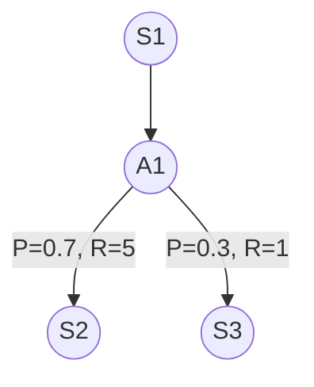

# Markov Decision Process

A Markov Decision Process (MDP) is a model for sequential decision making when 
outcomes are uncertain.

In an MDP, a decision maker must make a series of decisions over time, where
each action can result in a reward or cost. The goal is to find the best
sequence of actions to maximize the expected reward over a given time period.

An MDP is a 4-tuple, $(S, A, P, R)$, made up of four parts:
1. States
2. Actions
3. Transition probability function
4. Reward

For discrete states and actions the MDP can be represented as a [[Graph]].

For example, below is a graph representation of a MDP with three states and
a single action. Starting at state S1, taking action A1 results in a 70%
probability of transitioning to state S2 and a 30% probablitiy of transitioning
to state S3. The reward for S1 -> S2 is 5, while the reward for S1 -> S3 is 1.

## States

These are the nodes of the [[Graph]].

## Actions

Actions can be thought of as the edges in a traditional directed graph data
structure.

## Transition probability function

The transition probability function $P_a(s,s^\prime)$ determines the probability
that the action $a$ results in a transition to state $s^\prime$ when starting
from state $s$.

## Reward

The reward $R_a(s,s^\prime)$ is the reward accumulated after transitioning from
state $s$ to $s^\prime$ due to action $a$.

## Solving the MDP

Solving the MDP involves finding the optimal policy, $\pi^*$, to maximize reward
(or alternatively to minimize cost). Note that the optimal policy will
maximize expected reward due to the stochastic nature of the problem.

The optimal policy solves the optimization problem

$$
\begin{aligned}
\text{max} \ \ \mathcal{U} = \mathbb{E} \left [ \sum_{t = 0}^{\infty} R_{a_t}(s_t, s_{t+1}) \right ]
\end{aligned}
$$

This is equivalent to an [[Optimal Control]] problem, which can be solved
via [[Dynamic Programming for Optimal Control]].

The value function at state $s$, $V(s)$, is the expected
total reward starting at state $s$, which is given by

$$
\begin{aligned}
  V(s_k) &= \mathbb{E} \left [ \sum_{t = k}^{\infty} R_{a_t}(s_t, s_{t+1}) \right ] \\
\end{aligned}
$$

The expected value after applying action $a_k$ is equal to the sum of all
possible outcomes scaled by their probabilities. For action $a_k$, let
$S_{a_k}$ be the set of all possible outcome states. Then, the value function
is 

$$
\begin{aligned}
  V(s_k) &= \sum_{s_{k+1} \in S_{a_k}} P_{a_k}(s_k, s_{k+1}) \left ( R_{a_k}(s_k, s_{k+1})  + \mathbb{E} \left [ \sum_{t = k+1}^{\infty} R_{a_t}(s_t, s_{t+1}) \right ] \right ) \\
         &= \sum_{s_{k+1} \in S_{a_k}} P_{a_k}(s_k, s_{k+1}) \left ( R_{a_k}(s_k, s_{k+1}) + V(s_{k+1}) \right ) \\
         &= \mathbb{E} \left [ R_{a_k}(s_k, s_{k+1}) + V(s_{k+1}) \right ]
\end{aligned}
$$

The optimal value function satisfies the [[Hamilton Jacobi Bellman Equation]]

$$
\begin{aligned}
  V^*(s_k) &= \text{max}_{a_k} \  \mathbb{E} \left [ R_{a_k}(s_k, s_{k+1}) + V^*(s_{k+1}) \right ].
\end{aligned}
$$

and the optimal policy $a_k = \pi^*(s_k)$ is

$$
\begin{aligned}
  \pi^*(s_k) &= \text{argmax}_{a_k} \  \mathbb{E} \left [ R_{a_k}(s_k, s_{k+1}) + V^*(s_{k+1}) \right ].
\end{aligned}
$$

## Discount Factor

Often a discount factor $\gamma \in [0, 1]$ is included in the optimization
such that we seek to maximize the discounted utility

$$
\begin{aligned}
\text{max} \ \ \mathcal{U} = \mathbb{E} \left [ \sum_{t = 0}^{\infty} \gamma^t R_{a_t}(s_t, s_{t+1}) \right ].
\end{aligned}
$$

For $\gamma \in [0, 1)$, the discount factor ensures that the expected reward is
finite over the infinite horizon.

In this case the value function is

$$
\begin{aligned}
  V(s_k) &= \mathbb{E} \left [ R_{a_k}(s_k, s_{k+1}) + \gamma V(s_{k+1}) \right ].
\end{aligned}
$$

## Related

[[Partially Observable Markov Decision Process]]

