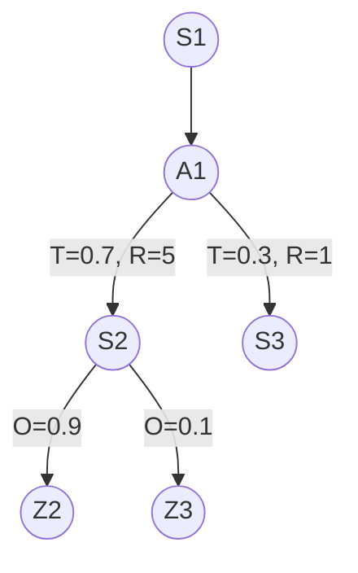
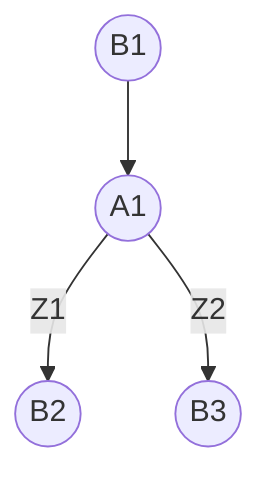

# Partially Observable Markov Decision Process

A Partially Observable Markov Decision Process (POMDP) is a generalization of a
[[Markov Decision Process]]. For the MDP the agent under consideration is
making decisions with full knowledge of the system state. The POMDP extends this
to the case where the agent must make observations of the underlying state,
where the observations themselves have some associated uncertainty.

The POMDP is defined at the 6-tuple $(S, A, T, R, Z, O)$, where, as in the
MDP:
- $S$ is the set of system states,
- $A$ is the set of actions,
- $T$ is the transition probability function,
- $R$ is the reward.

The POMDP adds two addtional parameters:
- $Z$ the set of observations (or measurements),
- $O$ the set of observation probabilities.

A iteration of the POMDP is as follows. First, the system is at some initial
state, $s_1 \in S$. The agent then performs an action $a_1 \in A$ that
transitions the state to a new state, $s_2$ with some probability
$T(s_2 | s_1, a_1)$. Then, the agent receives an observation $z_2$ with
probability $O(z_2 | s_2, a_1)$.

Like in the [[Markov Decision Process]] solving the POMDP involves finding
an optimal policy $\pi^*$ that maximizes the expected reward,

$$
\begin{aligned}
\text{max} \ \ \mathcal{U} = \mathbb{E} \left [ \sum_{t = 0}^{\infty} R_{a_t}(s_t, s_{t+1}) \right ].
\end{aligned}
$$

## Belief State

The belief, $b(s)$, is the probability that the system is in state $s$
given the history of observations and actions, and an initial belief
(see [[Bayes Filter]]).
This is given by

$$
\begin{aligned}
  b_t(s) &= p(s | z_{0:t}, a_{0:t-1}, b_0) \\
         &= p(s | z_{0:t}, a_{0:t-1}).
\end{aligned}
$$

The notation $b_t$ denotes the belief at step $t$, which can be queried
for any state $s \in S$. If $b_t$ is a *sufficient statistic* of all previous
controls and measurements, then $b_t(s) = p(s | b_{t-1}, z_{t}, a_{t-1})$.

## Belief MDP

The POMDP can be formulated as a Belief [[Markov Decision Process]], which
is defined by the tuple $(B, A, \tau, r)$ where
- $B$ is the set of beliefs.
- $A$ is the set of actions.
- $\tau: B \times A \times Z \rightarrow B$ is the belief transition function.
- $r: B \times A \rightarrow \mathbb{R}$ is the expected reward.

### Derivation of Transition Function

The transition function can be derived in the following way.

First, the belief before incorporating the current measurement, called the prior
or the prediction, is
$\bar{b}_t(s) = p(s| z_{0:t-1}, a_{0:t-1}) = p(s | b_{t-1}, a_{t-1})$.

Then, using [[Bayes Theorem]] gives the update relation between $b_t$ and
    Z2((Z2))
$\bar{b}_t$,

$$
\begin{aligned}
  b_t(s) &= p(s | \bar{b}_t, z_t ) \\
         &= \frac{ p(s | \bar{b}_t) p(z_t | s, \bar{b}_t)}{p(z_t | \bar{b}_t)} \\
         &= \frac{ p(z_t | s)}{p(z_t | \bar{b}_t)}\bar{b}_t(s).
\end{aligned}
$$

The prior belief after action $a_{t-1}$ is related to the previous belief via
the relation

$$
\begin{aligned}
  \bar{b}_t(s) &= p(s | b_{t-1}, a_{t-1})  \\
               &= \sum_{s_{t-1} \in S} p(s | s_{t-1}, b_{t-1}, a_{t-1}) p(s_{t-1} | b_{t-1}) \\
               &= \sum_{s_{t-1} \in S} p(s | s_{t-1}, a_{t-1}) b_{t-1}(s_{t-1}).
\end{aligned}
$$

The denominator of the update equation is

$$
\begin{aligned}
  p(z_t | \bar{b}_t) &= \sum_{s \in S} p(z_t |  s, \bar{b}_t) p(s | \bar{b}_t) \\
                        &= \sum_{s \in S} p(z_t |  s) \bar{b}_t(s)
\end{aligned}
$$

Combining all of the above yeilds the transition function $\tau$, 

$$
\begin{aligned}
  b_t(s) &= \frac{\sum_{s_{t-1} \in S} p(s|s_{t-1}, a_{t-1})b_{t-1}(s_{t-1})}{\sum_{\sigma \in S} p(z_t|\sigma) \sum_{s_{t-1} \in S} p(\sigma | s_{t-1}, a_{t-1}) b(s_{t-1})}  \\
  &= \tau(b_{t-1}, a_{t-1}, z_t).
\end{aligned}
$$

## Solving the Belief MDP

