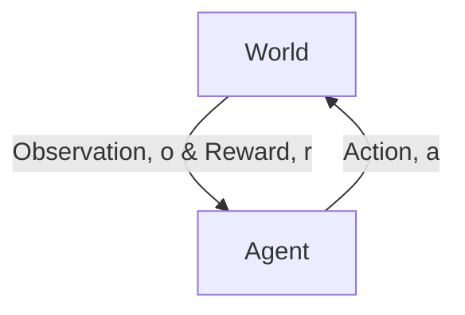

# Reinforcement Learning

> [!question] Key Problem
> How can an intelligent agent learn to make a *good* sequence of decisions?

Reinforcement learning is a type of [[machine learning]] where an agent learns
to make decisions by interacting with an environment. The agent receives
feedback in the form of rewards or penalties, and its goal is to maximize the
expected discounted sum of rewards over time.

## Markov Decision Process Planning
- [[Markov Decision Process]]
- [[Value Function]]
- [[Q Function]]
- [[Policy Evaluation]]
    - [[Policy Iteration]]
    - [[Value Iteration]]
    - [[Monte Carlo Rollout]]

## Model Free Policy Evaluation

- Goal: Select actions to maximize total *expected* future reward.
- May require balancing between immediate and long term rewards.
- May require strategic behavior to achieve high rewards.

|                        | Planning |  SL  | UL   |  RL  |  IL  |
| -----------------------| -------- | ---- | ---- | ---- | ---- | 
| Optimization           |    x     |      |      |  x   |   x  | 
| Learns from experience |          |  x   |  x   |  x   |   x  |
| Generalization         |    x     |  x   |  x   |  x   |   x  |
| Delayed Consequences   |    x     |      |      |  x   |   x  |
| Exploration            |          |      |      |  x   |   x  |

- SL: supervised learning
- UL: unsupervised learning
- RL: reinforcement learning
- IL: imitation learning

**Key Concepts:**

* **Agent:** The decision-maker that interacts with the environment.
* **Environment:** The system that the agent interacts with.
* **State:** The current situation or configuration of the environment.
* **Action:** A choice made by the agent to influence the environment.
* **Reward:** A numerical value indicating the immediate outcome of an action.
* **Policy:** A strategy that maps states to actions.
* **Value Function:** A function that estimates the expected future reward from a given state.
* **Model:** A representation of the environment's dynamics.

**Learning Process:**

1. **Initialization:** The agent starts in an initial state.
2. **Action Selection:** The agent selects an action based on its current policy.
3. **State Transition:** The environment transitions to a new state as a result of the action.
4. **Reward Receipt:** The agent receives a reward from the environment.
5. **Policy Update:** The agent updates its policy based on the received reward and the new state.

**Types of Reinforcement Learning:**

* **Model-Based Reinforcement Learning:** The agent learns a model of the environment and uses it to plan future actions.
* **Model-Free Reinforcement Learning:** The agent learns directly from experience without explicitly modeling the environment. 

**Algorithms:**

* [[Dynamic Programming]] Algorithms that solve optimal control problems by iteratively computing optimal policies.
* [[Monte Carlo Methods]] Algorithms that learn from complete episodes of experience.
* [[Temporal Difference Learning]] Algorithms that learn from incomplete episodes of experience by bootstrapping value estimates.

## Resources
[Stanford CS234: Reinforcement Learning](https://youtu.be/WsvFL-LjA6U?si=nFsXYFY0y3vgAikw)
[RL Course by David Silver](https://youtu.be/2pWv7GOvuf0?si=ffvyEvnAlfPjvG_r)
